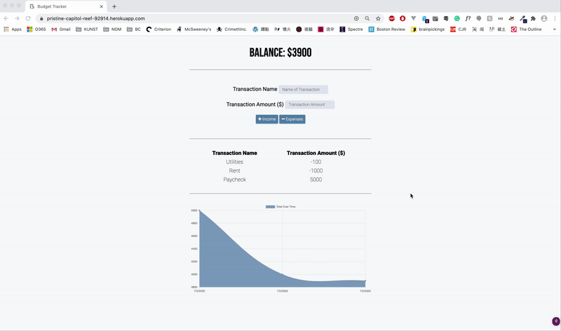
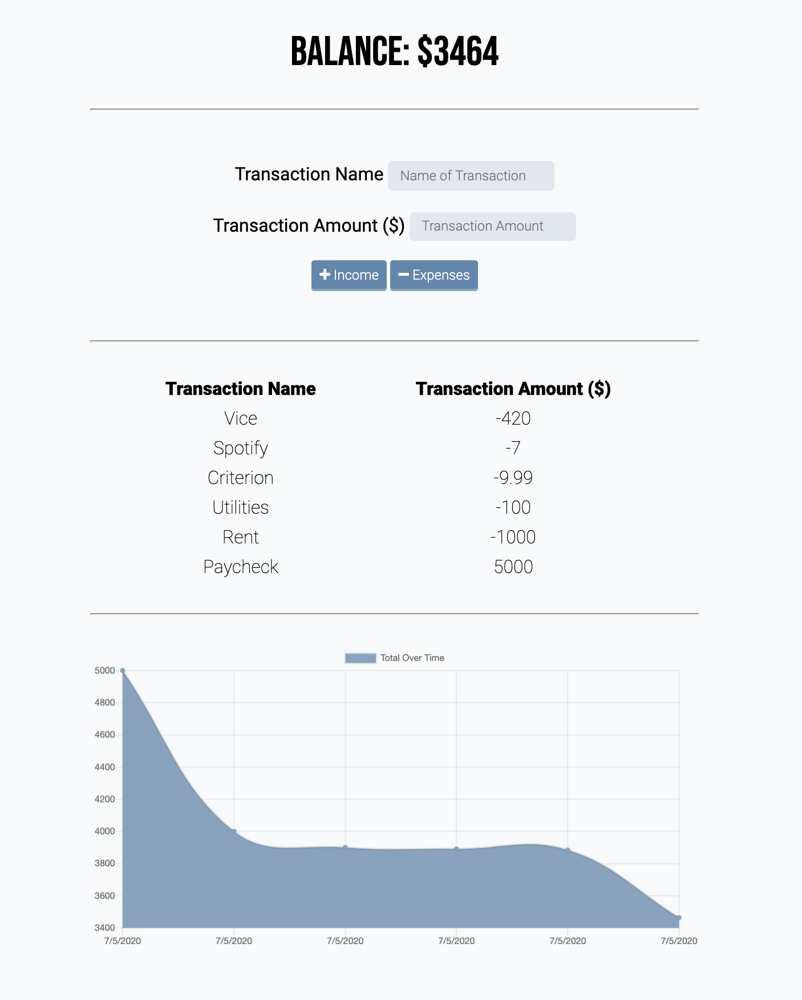

# Budget Tracker

Budget Tracker allows user to save/add transactions, view recent transactions in a table, as well as view an overall summary in chart form. The user will be use the app/ able to save new transactions in offline mode.

## Tech
* node.js
* express.js
* mongoDB
* mongoose
* PWA

## Process
1. Created budget database on mongoDB
2. Created manifest.webmanifest file, linked to html
3. Created service-worker.js file, linked to html
4. Created db.js file - checks if app is online, create/record transaction on pending object store with readwrite access

## Deployed
[Deployed on Heroku](https://pristine-capitol-reef-92914.herokuapp.com/)

## Screenshots 
